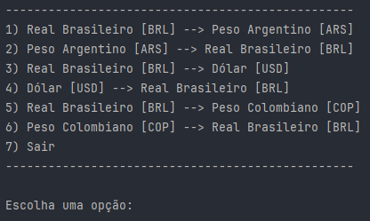
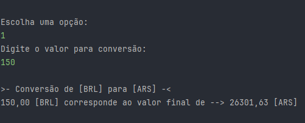

<h1 align="center">Conversor de Moedas 🪙</h1>

<h4> Este projeto é um Conversor de Moedas interativo, desenvolvido em Java, 
que permite aos usuários converter entre diferentes moedas com taxas de câmbio 
atualizadas em tempo real. Utilizando uma API de taxas de câmbio, o programa consulta 
os valores das moedas e fornece uma conversão precisa com base nos dados mais recentes. 
O projeto oferece uma interface de texto simples e intuitiva 
para interação com o usuário via console. </h4>

Challenge Alura + Oracle - ONE

<h1 align="center"> 👨‍💻 Projeto </h1>

<h3 align="center">Tela inicial</h3>

<h3 align="center">Resultado da conversão</h3>

## Requisitos funcionais do projeto
1. **Conversão entre Moedas:** O usuário pode selecionar entre no mínimo 6 tipos de conversão de moedas diferentes, disponíveis em um menu de opções no console.
2. **Atualização em Tempo Real:** As taxas de câmbio são obtidas dinamicamente a partir de uma API, garantindo que o usuário tenha sempre dados atuais para as conversões.
3. **Interação via Console:** A interface de texto permite que o usuário selecione a opção desejada e insira o valor que deseja converter.

## 💲Conversão entre moedas:
- **[BRL]** - Real Brasileiro
- **[ARS]** - Peso Argentino
- **[USD]** - Dólar 
- **[COP]** - Peso Colombiano

## 🚀 Tecnologias
- **JAVA**
- **Exchange Rate API** - Api de taxa de câmbio
- **Gson** - Biblioteca para a manipulação de JSON em Java

## Contato
- murilopizolito@gmail.com